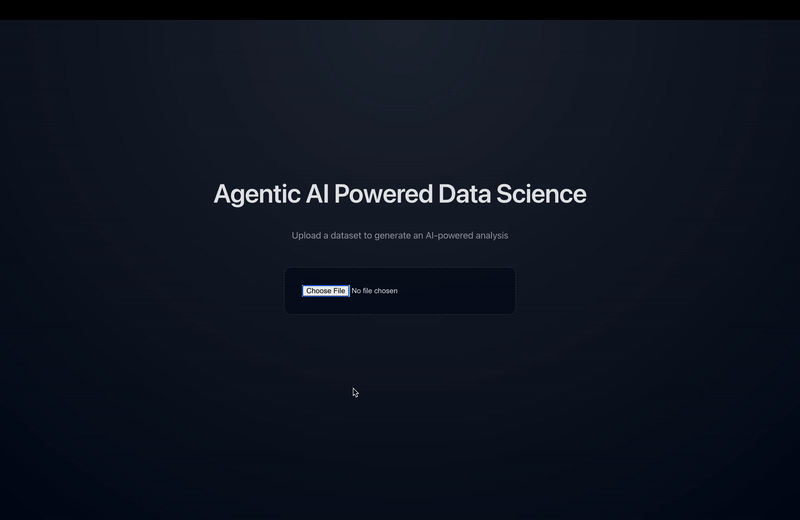
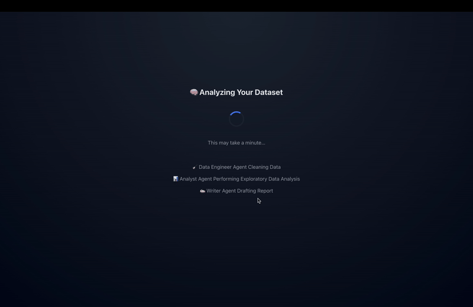

# Exploring a dataset via Agentic AI
A web application that can produce insights and analyses on an uploaded dataset by running a multi-agent system specialized in data science workflows.

### Environment Variables

Create a `.env` file from the example:

```bash
cp .env.example .env
```

**You will need your own OPENAI API key!**

## Installation
Download this repo first.

Then, install all dependencies for Python and React:

``` sh
pip3 install -e .
```

``` sh
cd react-app
npm install
```

## Running the App
You can run the app with:
``` sh
npm start
```
**Note: Should be in the react-app directory while running the above command.**

Start the FastAPI backend with:
``` sh
uvicorn api:app --reload
```

## About This App
This project is a **full-stack AI-powered analytics platform** built with **CrewAI**, **React**, and **FastAPI**. At its core, it leverages a **multi-agent AI system**, where specialized agents autonomously handle key data science tasks such as **data cleaning**, **exploratory data analysis**, along with generating insights and next steps.

The platform allows users to **upload datasets** through an intuitive **React interface** and automatically receive:

- Comprehensive data analyses, including summary statistics and trends

- Visualizations, such as charts and graphs, to easily interpret results

- Actionable insights and reports, delivered in a structured and easy-to-read format

By combining **CrewAI’s** autonomous agents with a responsive **frontend** and efficient **backend**, this application simplifies the data analytics workflow, enabling users to gain meaningful insights from their data quickly and effortlessly.

# Demos




